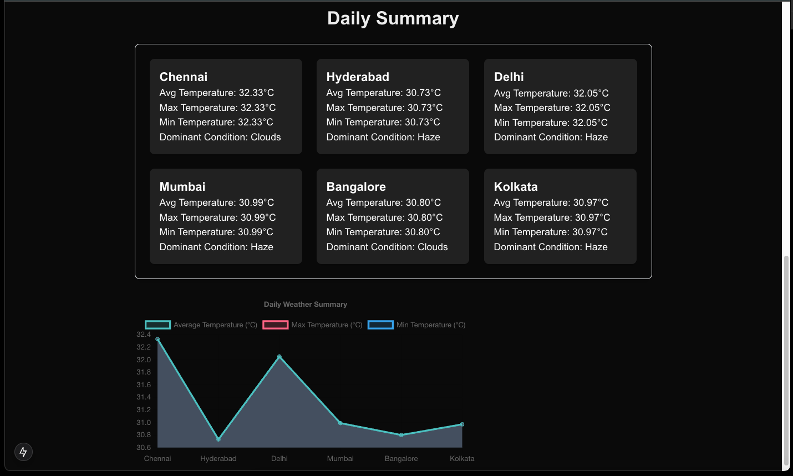

# Weather Monitoring Application

This is a [Next.js](https://nextjs.org) project bootstrapped with [`create-next-app`](https://nextjs.org/docs/app/api-reference/cli/create-next-app).

## Overview

The Weather Monitoring Application provides real-time weather data and alerts for various cities in India. Users can set temperature thresholds to receive notifications via WebSockets when these thresholds are exceeded.

## Features

- Real-time weather updates from the OpenWeatherMap API.
- Daily weather summaries for each monitored city.
- User-defined alerts for temperature thresholds.
- Built with Next.js and TypeScript.

## Console ScreenShots



## Getting Started

To set up and run this application locally, follow these steps:

### Prerequisites

1. Install [Node.js](https://nodejs.org/) (v18 or higher).
2. Install [Docker](https://docs.docker.com/get-docker/).
3. Ensure you have access to an OpenWeatherMap API key.

### Clone the Repository

First, clone the repository:

```bash
git clone <your-github-repo-url>
cd weather-monitoring-app
